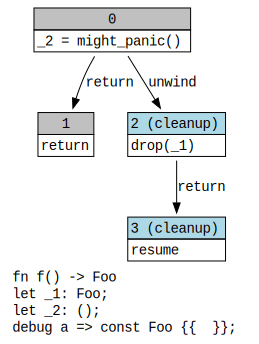

# Drop During Stack Unwinding

The compiler inserts clean up code to handle clean up after functions that might
panic.

```rust,editable
pub struct Foo {}

impl Drop for Foo {
	fn drop(&mut self) {
		println!("{:?}", "dropped!");
	}
}

extern "Rust" {
    fn might_panic();
}

pub fn f() -> Foo {
	let a = Foo {};
	unsafe {
    	might_panic();
	}
	a
}
```

If we build this example[^note] and look at the MIR output we will see the following output:

```mir,editable
// MIR for `f` after runtime-optimized

fn f() -> Foo {
    let mut _0: Foo;
    let _1: Foo;
    let _2: ();
    scope 1 {
        debug a => const Foo {{  }};
        scope 2 {
        }
    }

    bb0: {
        _2 = might_panic() -> [return: bb1, unwind: bb2];
    }

    bb1: {
        return;
    }

    bb2 (cleanup): {
        drop(_1) -> [return: bb3, unwind terminate(cleanup)];
    }

    bb3 (cleanup): {
        resume;
    }
}
```

We can also get a graph representation:

<center>



</center>

The machine code looks like this when targeting x86_64:

```asm,editable
example::f:
        pushq   %rbx
        callq   *unknown_api@GOTPCREL(%rip)
        popq    %rbx
        retq
        movq    %rax, %rbx
        callq   core::ptr::drop_in_place<example::Foo>
        movq    %rbx, %rdi
        callq   _Unwind_Resume@PLT
        ud2
        callq   *core::panicking::panic_cannot_unwind@GOTPCREL(%rip)
        ud2
```

The cleanup code is lines 6-12.

[^note]: Build with `rustc +nightly --crate-type=lib -Z dump-mir=f -Z dump-mir-graphviz test.rs` and look at
`mir_dump/test.f.006-000.runtime-optimized.after.mir` and
`mir_dump/test.f.006-000.runtime-optimized.after.dot`.

